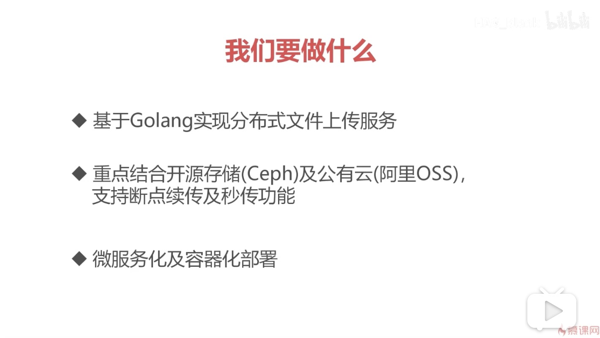
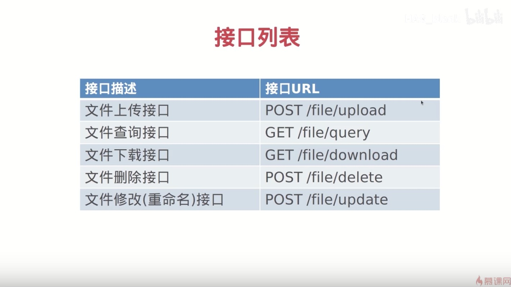

# 1、简版服务架构说明



# 2、接口列表



# 3、文件上传接口

filestore-server/handler/handler.go

```golang
// FileUploadHandler ：上传文件
func FileUploadHandler(w http.ResponseWriter, r *http.Request) {
	if r.Method == "GET" {
		// GET 方法获取上传主页

	} else if r.Method == "POST" {
		// POST 方法获取文件上传内容

	}
}
```

# 4、在main函数中设定路由规则

main.go
```golang
package main

import (
	"filestore-server/handler"
	"fmt"
	"net/http"
)

func main() {
	http.HandleFunc("/file/upload", handler.FileUploadHandler)
	err := http.ListenAndServe(":8090", nil)
	if err != nil {
		fmt.Printf("Failed to start server, err:%s", err.Error())
	}
}
```
