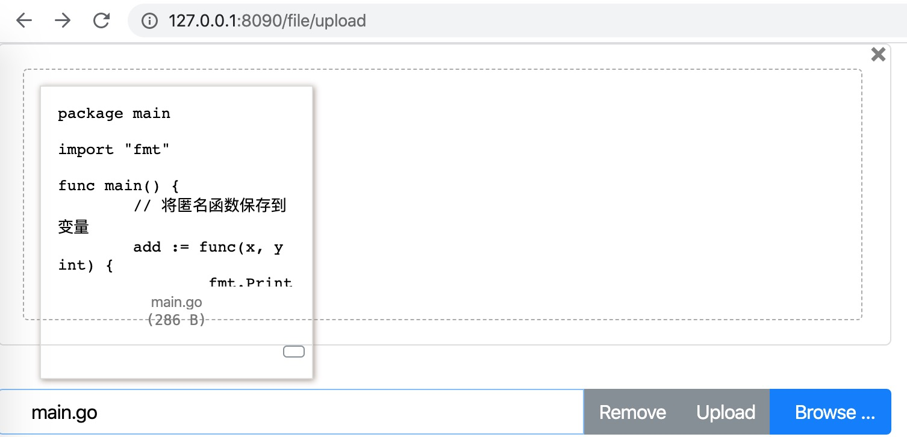

# 1、上传接口

```golang
// FileUploadHandler : 处理文件上传
func FileUploadHandler(w http.ResponseWriter, r *http.Request) {
	if r.Method == "GET" {
		// 返回上传 HTML 界面
		data, err := ioutil.ReadFile("./static/view/index.html")
		if err != nil {
			io.WriteString(w, "internal server error")
			return
		}
		io.WriteString(w, string(data))
	} else if r.Method == "POST" {
		// 接收文件流及存储到本地目录
		file, head, err := r.FormFile("file")
		if err != nil {
			fmt.Printf("Failed to get data, err:%s\n", err.Error())
			return
		}
		// 关闭文件句柄
		defer file.Close()

		newFile, err := os.Create("/tmp/" + head.Filename)

		if err != nil {
			fmt.Printf("Failed to create file, err:%s\n", err.Error())
			return
		}
		// 关闭文件句柄
		defer newFile.Close()

		_, err = io.Copy(newFile, file)
		if err != nil {
			fmt.Printf("Failed to save data into file, err:%s\n", err.Error())
			return
		}

		// 上传成功重定向
		http.Redirect(w, r, "/file/upload/suc", http.StatusFound)
	}
}
```

# 2、文件上传成功接口

```golang
// UploadSucHandler : 文件上传成功接口
func UploadSucHandler(w http.ResponseWriter, r *http.Request) {
	io.WriteString(w, "Upload finished!")
}
```

# 3、在main函数中设定路由规则

```golang
	// 定义文件上传成功接口路由
	http.HandleFunc("/file/upload/suc", handler.UploadSucHandler)
```

# 4、文件上传演示



# 5、文件上传成功

