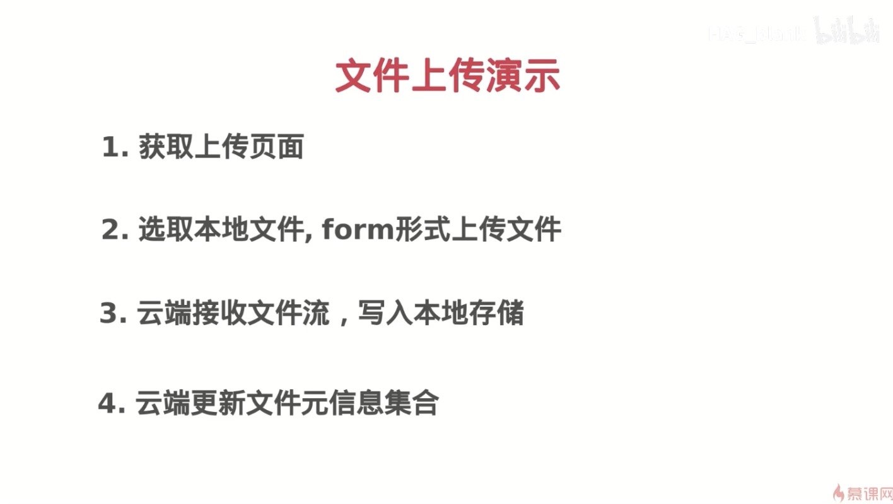
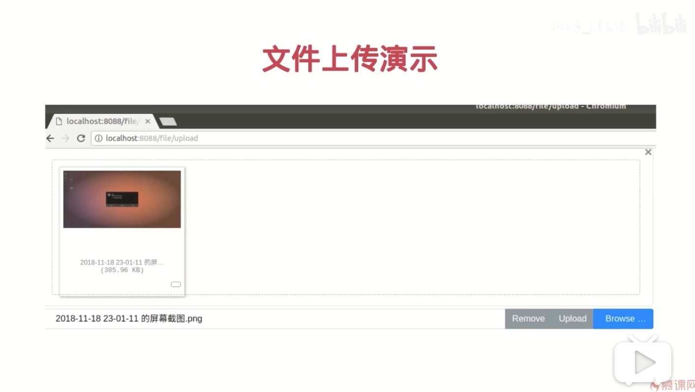

# 1、文件上传演示1



# 2、文件上传演示2



# 3、单文件元信息查询接口

```golang
// GetFileMetaHandler : 获取文件元信息
func GetFileMetaHandler(w http.ResponseWriter, r *http.Request) {
	r.ParseForm()

	// 获取文件的filehash
	filehash := r.Form["filehash"][0]
	fMeta := meta.GetFileMeta(filehash)
	data, err := json.Marshal(fMeta)

	if err != nil {
		w.WriteHeader(http.StatusInternalServerError)
		return
	}

	w.Write(data)
}
```

# 4、查询接口演示

```golang
// 1、首先获取文件的sha1值
$ shasum main.go
ebbf25d6c902d49c1db4a4db81a9fe1dd7934774  main.go

// 2、通过接口把参数sha1值参入进去访问，看返回是否OK
http://127.0.0.1:8090/file/meta?filehash=ebbf25d6c902d49c1db4a4db81a9fe1dd7934774

{"FileSha1":"ebbf25d6c902d49c1db4a4db81a9fe1dd7934774","FileName":"main.go","FileSize":286,"Location":"/tmp/main.go","UploadAt":"2020-03-26 15:35:39"}

// 3、在线json格式化校验
http://www.bejson.com/wz.zip
```

