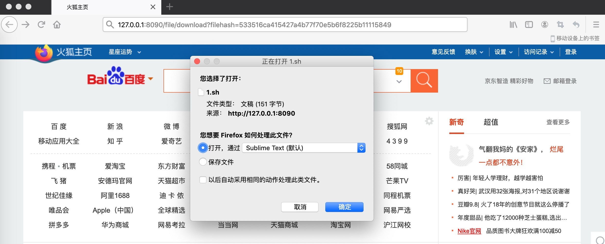

# 1、文件下载接口

```golang
// DownloadHandler : 文件下载接口
func DownloadHandler(w http.ResponseWriter, r *http.Request) {
	r.ParseForm()
	filehash := r.Form.Get("filehash")
	// TODO：加载已存储到云端本地的文件内容，并返回到客户端
}
```

# 2、测试文件下载

```golang
// 1、因为这里filemeta信息暂未做持久化操作，所以需要新上传一个文件，然后得到该文件的sha1值
533516ca415427a4b77f70e5b6f8225b11115849

// 2、使用该文件的sha1值测试下载文件
http://127.0.0.1:8090/file/download?filehash=533516ca415427a4b77f70e5b6f8225b11115849
```

