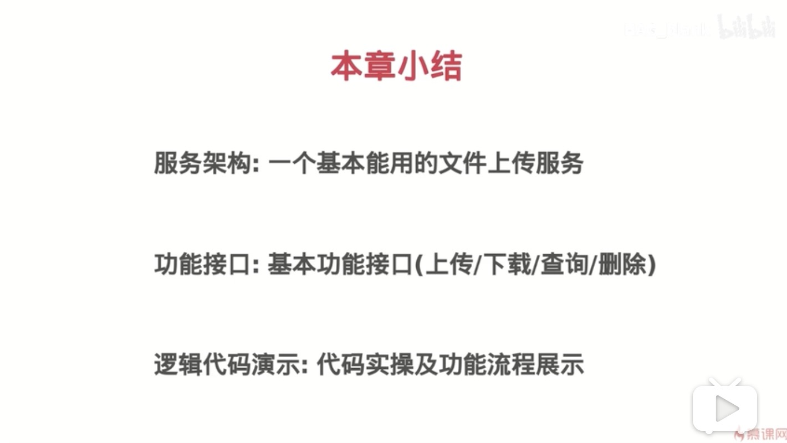

# 1、文件Meta更新(重命名)接口

```golang
// FileMetaUpdateHandler : 更新元信息接口（重命名）
func FileMetaUpdateHandler(w http.ResponseWriter, r *http.Request) {
	r.ParseForm()

	filehash = r.Form.Get("filehash")
	// TODO：删除本地文件
}
```

# 2、文件删除接口

```golang
// FileDeleteHandler : 删除文件及元信息
func FileDeleteHandler(w http.ResponseWriter, r *http.Request) {
	r.ParseForm()

	fileSha1 := r.Form.Get("filehash")
	fMeta := meta.GetFileMeta(fileSha1)

	// 删除文件
	os.Remove(fMeta.Location)
	// 删除文件元信息
	meta.RemoveFileMeta(fileSha1)

	w.WriteHeader(http.StatusOK)
}
```

# 3、postman测试文件重命名接口

```golang
// POST文件重命名
http://127.0.0.1:8090/file/update?op=0&filehash=56d483a03d444ec01330d9304c6b006c4113e318&filename=newfile.txt

{"FileSha1":"56d483a03d444ec01330d9304c6b006c4113e318","FileName":"newfile.txt","FileSize":1679,"Location":"/tmp/id_rsa","UploadAt":"2020-03-27 21:13:44"}

// 查看验证下
http://127.0.0.1:8090/file/meta?filehash=56d483a03d444ec01330d9304c6b006c4113e318

{"FileSha1":"56d483a03d444ec01330d9304c6b006c4113e318","FileName":"newfile.txt","FileSize":1679,"Location":"/tmp/id_rsa","UploadAt":"2020-03-27 21:13:44"}
```

# 4、小结


