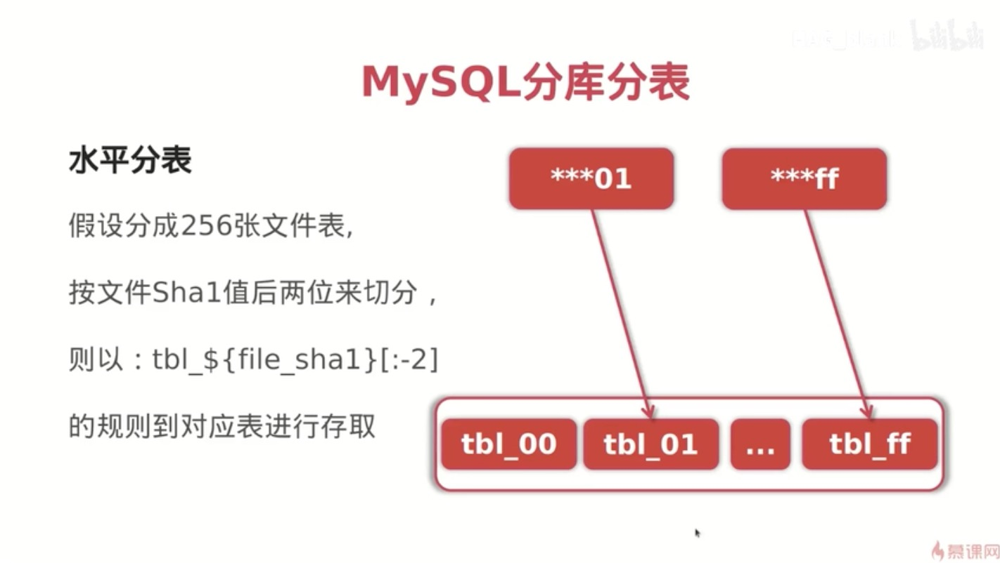
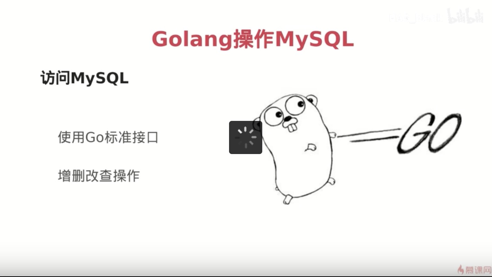

# 1、创建数据库和表结构

```sql
-- 创建数据库
create database fileserver default character set utf8;

-- 切换数据库
use fileserver;

-- 创建文件表
CREATE TABLE `tbl_file` (
  `id` int(11) NOT NULL AUTO_INCREMENT,
  `file_sha1` char(40) NOT NULL DEFAULT '' COMMENT '文件hash',
  `file_name` varchar(256) NOT NULL DEFAULT '' COMMENT '文件名',
  `file_size` bigint(20) DEFAULT '0' COMMENT '文件大小',
  `file_addr` varchar(1024) NOT NULL DEFAULT '' COMMENT '文件存储位置',
  `create_at` datetime default NOW() COMMENT '创建日期',
  `update_at` datetime default NOW() on update current_timestamp() COMMENT '更新日期',
  `status` int(11) NOT NULL DEFAULT '0' COMMENT '状态(可用/禁用/已删除等状态)',
  `ext1` int(11) DEFAULT '0' COMMENT '备用字段1',
  `ext2` text COMMENT '备用字段2',
  PRIMARY KEY (`id`),
  UNIQUE KEY `idx_file_hash` (`file_sha1`),
  KEY `idx_status` (`status`)
) ENGINE=InnoDB DEFAULT CHARSET=utf8;

-- 查看数据表
show create table tbl_file\G;
```

# 2、海量数据解决方案

```golang
海量数据的时候，一张表存不下那么多数据，有以下几种方法：

1、分库分表
```

# 3、分表详解

1、垂直分表

把之前大表中的不同的字段切分到不同的表中，然后通过唯一键关联起来。

2、水平分表

把大表中的所有的数据平分到N个表，然后这些表的结构都是一样的。水平分表的方法



水平分表扩容不太好处理，假如一开始256张表，现在想要扩展到512张表。需要额外添加一些逻辑保证旧的文件hash到旧的表中，而新的数据按新的规则hash到这512张表中。目前数据量不太，单表即可

# 4、Golang操作Mysql




