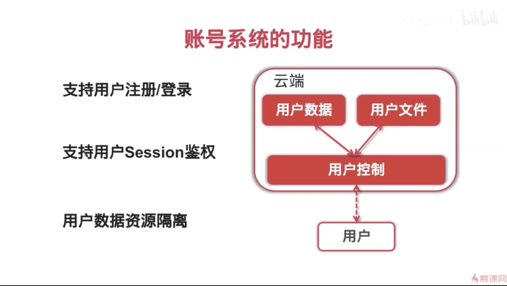
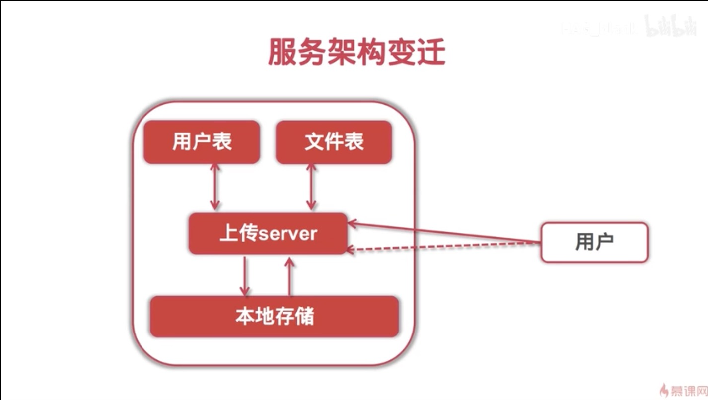

# 1、账号系统的功能



# 2、服务架构变迁



# 3、mysql用户表设计

```sql
-- 创建用户表
CREATE TABLE `tbl_user` (
  `id` int(11) NOT NULL AUTO_INCREMENT,
  `user_name` varchar(64) NOT NULL DEFAULT '' COMMENT '用户名',
  `user_pwd` varchar(256) NOT NULL DEFAULT '' COMMENT '用户encoded密码',
  `email` varchar(64) DEFAULT '' COMMENT '邮箱',
  `phone` varchar(128) DEFAULT '' COMMENT '手机号',
  `email_validated` tinyint(1) DEFAULT 0 COMMENT '邮箱是否已验证',
  `phone_validated` tinyint(1) DEFAULT 0 COMMENT '手机号是否已验证',
  `signup_at` datetime DEFAULT CURRENT_TIMESTAMP COMMENT '注册日期',
  `last_active` datetime DEFAULT CURRENT_TIMESTAMP ON UPDATE CURRENT_TIMESTAMP COMMENT '最后活跃时间戳',
  `profile` text COMMENT '用户属性',
  `status` int(11) NOT NULL DEFAULT '0' COMMENT '账户状态(启用/禁用/锁定/标记删除等)',
  PRIMARY KEY (`id`),
  UNIQUE KEY `idx_username` (`user_name`),
  KEY `idx_status` (`status`)
) ENGINE=InnoDB AUTO_INCREMENT=5 DEFAULT CHARSET=utf8mb4;
```